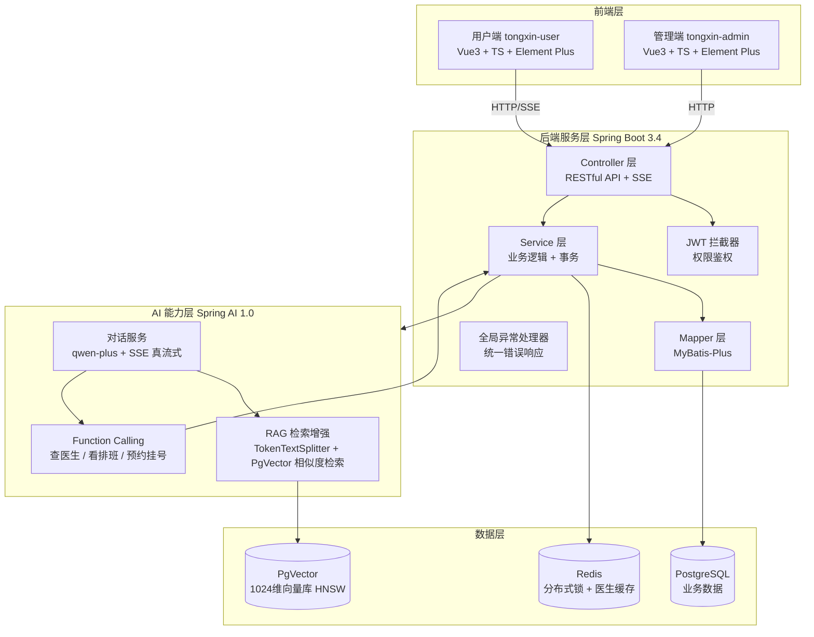

# 同心医院 AI 智能助手

基于 Spring Boot 3 + Spring AI + Vue3 的医疗 AI 全栈应用，实现智能问诊、医生查询、在线预约挂号全流程闭环。AI 不仅能对话，还能通过 Function Calling 直接调用后端服务完成预约挂号。

## 技术栈

| 层级 | 技术 |
|------|------|
| 前端 | Vue 3 + TypeScript + Vite + Element Plus + Pinia + Vue Router |
| 后端 | Spring Boot 3.4.2 + Java 17 + MyBatis-Plus + Spring AI 1.0 |
| AI 模型 | 阿里云百炼 DashScope（通义千问 qwen-plus 对话 / text-embedding-v3 向量） |
| 数据库 | PostgreSQL + PgVector（向量存储，HNSW 索引） |
| 缓存/锁 | Redis（分布式锁 + 热点数据缓存） |
| 安全 | JWT 鉴权 + BCrypt 加密 + 拦截器 |
| 其他 | SSE 流式输出、全局异常处理、Lombok |

## 系统架构



## 核心功能

### 1. AI 智能对话（真 SSE 流式）
- 基于 Spring AI + 通义千问 qwen-plus，逐 token 流式输出（打字机效果）
- 支持多轮对话，历史上下文自动拼接（最多回溯 10 条）
- 医疗场景系统提示词，明确禁止给出诊断和处方，引导就医

### 2. RAG 检索增强
- 文档经 TokenTextSplitter 按 token 切分，向量化后存入 PgVector
- 对话时按相似度 Top-K 召回知识片段，注入 Prompt 上下文
- 相似度阈值 0.5，检索失败自动退化为纯对话模式

### 3. Function Calling（AI 工具调用）
AI 可自动调用以下工具，所有数据来自数据库，杜绝编造：
- `queryDoctors`：按科室/关键词搜索真实医生
- `getDoctorDetail`：查看医生详情
- `getDoctorSchedule`：查看医生排班和剩余号源
- `bookAppointment`：帮助患者创建预约挂号

### 4. 预约挂号（防超卖）
- 患者可查询医生排班、选择时段在线预约
- **Redis 分布式锁**防止并发超卖：同一医生+日期+时段的请求串行化
- 每时段号源上限 10 人，支持取消预约
- 重复预约校验、日期校验、时段格式校验

### 5. 医生与排班管理
- 医生列表分页查询（按科室/关键词过滤）
- 医生详情 Redis 缓存（TTL 10 分钟）
- 排班自动生成（上午 8 段 + 下午 7 段，每 30 分钟一段），剩余号源实时计算
- 排班数据 Redis 缓存（TTL 2 分钟，兼顾实时性与性能）

### 6. 用户与权限
- JWT Token 鉴权，用户端/管理端双角色
- BCrypt 密码加密，拦截器统一鉴权
- 全局异常处理器，统一错误响应格式

## 项目结构

```
tongxin-medical-ai-assistant/
├── src/main/java/com/tongxin/ai/
│   ├── controller/          # REST 控制器（含 SSE 流式接口）
│   ├── service/             # 业务逻辑
│   │   ├── impl/            # 服务实现
│   │   ├── tools/           # AI Function Calling 工具
│   │   ├── AIChatService.java       # AI 对话（真流式）
│   │   ├── KnowledgeBaseService.java # RAG 知识库
│   │   └── RedisLockService.java    # Redis 分布式锁
│   ├── mapper/              # MyBatis-Plus Mapper
│   ├── entity/po/           # 数据库实体
│   ├── dto/                 # 数据传输对象
│   ├── config/              # 配置（Redis、WebMvc、全局异常）
│   ├── interceptor/         # JWT 鉴权拦截器
│   ├── common/              # 通用类（Result、BusinessException）
│   └── util/                # 工具类（JWT、密码加密）
├── src/main/resources/
│   └── application.yaml     # 应用配置（敏感信息走环境变量）
├── tongxin-user/            # 用户端前端（Vue3 + TS）
├── tongxin-admin/           # 管理端前端（Vue3 + TS）
├── tongxin.sql              # 数据库初始化脚本
└── pom.xml
```

## 快速开始

### 环境要求
- JDK 17+
- Maven 3.6+
- PostgreSQL 14+（需安装 pgvector 扩展）
- Redis 6+
- Node.js 18+（前端）

### 1. 数据库初始化
```bash
# 创建数据库并启用 pgvector
createdb vectordb
psql -d vectordb -c "CREATE EXTENSION IF NOT EXISTS vector;"

# 执行初始化脚本
psql -d vectordb -f tongxin.sql
```

### 2. 配置环境变量
```bash
# 必填
export DASHSCOPE_API_KEY=your_dashscope_api_key

# 可选（有默认值，本地开发可不设）
export DB_URL=jdbc:postgresql://localhost:5432/vectordb
export DB_USERNAME=postgres
export DB_PASSWORD=your_db_password
export REDIS_HOST=localhost
export REDIS_PORT=6379
export JWT_SECRET=your_base64_encoded_secret
```

### 3. 启动后端
```bash
mvn spring-boot:run
```
后端默认运行在 `http://localhost:8080`

### 4. 启动前端
```bash
# 用户端
cd tongxin-user
npm install
npm run dev

# 管理端（另开终端）
cd tongxin-admin
npm install
npm run dev
```

### 默认账号
- 管理员：`admin / 123456`（生产环境请务必修改）

## AI 能力亮点说明

### 真 SSE 流式 vs 伪流式
本项目使用 Spring AI `stream().content()` 实现逐 token 输出，而非"先拿完整结果再切分"的伪流式。工具调用循环由 Spring AI 自动处理，AI 发起 tool call → 执行工具 → 回填结果 → 继续流式生成。

### Function Calling 防幻觉
所有医生信息、排班号源必须通过工具从数据库获取，系统提示词明确禁止编造。预约工具内置登录态校验、日期/时段格式校验，异常以自然语言返回给 AI 转告用户。

### Redis 分布式锁防超卖
预约创建时按 `lock:appointment:{doctorId}:{date}:{time}` 加锁，锁粒度精确到时段，不影响其他时段并发。锁使用 SET NX PX + Lua 脚本释放，防止误删他人锁。排班缓存 TTL 设为 2 分钟，预约变更后短暂不一致可接受（可扩展为主动清除缓存）。

## License
MIT
